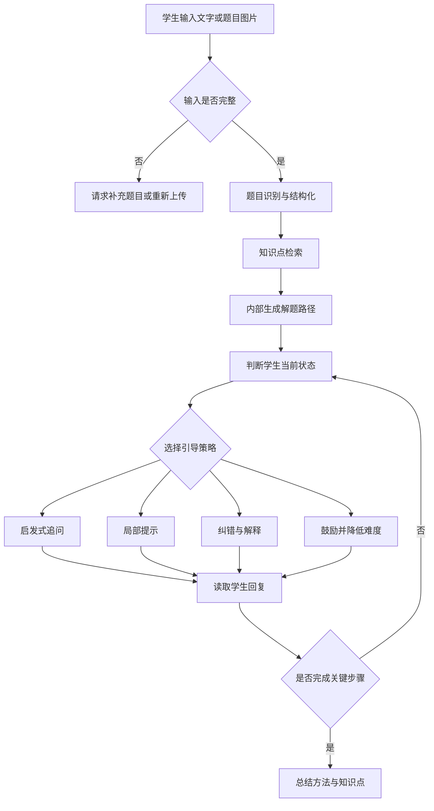
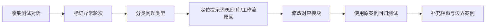

# 苏格拉底式启发教学 Agent

> 基于 Coze 搭建的教育类 AI Agent，通过“识别题目—理解知识点—拆解思路—启发追问”的多轮交互，引导学生主动完成解题，而不是直接输出答案。

* **项目类型：** AI 教育产品 / 多模态 Agent
* **应用场景：** 小学数学题目辅导
* **项目阶段：** 个人作品，已完成原型搭建与测试对话验证
* **体验地址：** [点击体验 Coze Agent](https://www.coze.cn/store/agent/7603941188114382848?bot_id=true)

---

## 1. 项目概述

传统搜题产品通常以“识别题目—展示答案”为主要路径，能够快速解决“这道题答案是什么”，但较难解决“学生为什么不会、卡在哪一步、如何自己推导出答案”。

本项目尝试将 AI 从“答案生成工具”转变为“解题过程引导者”：在理解题目后，不直接给出最终答案，而是根据题目知识点、当前解题进度和学生反馈，生成难度适中的提示与追问，模拟老师逐步启发学生思考的过程。

### 核心价值

| 传统搜题方式        | 本项目的设计方向       |
| ------------- | -------------- |
| 直接展示答案与解析     | 优先提问，引导学生表达思路  |
| 使用统一的完整解析     | 根据学生当前状态分步提供提示 |
| 容易出现超出学习阶段的解释 | 通过教材知识库约束知识范围  |
| 单轮完成任务        | 根据上下文进行多轮连续引导  |
| 忽略学生的畏难与急躁    | 识别对话状态并调整引导策略  |

---

## 2. 为什么做这个产品

### 2.1 用户问题

学生使用传统搜题软件时，常见问题包括：

1. **答案替代思考：** 学生可以快速获得答案，但不一定理解关键步骤。
2. **解析难度不匹配：** 模型可能使用超出当前学习阶段的公式或方法。
3. **缺少过程反馈：** 产品无法判断学生具体卡在读题、列式、计算还是概念理解。
4. **多轮体验不连续：** 学生回答后，系统可能重复提问、忽略已有信息或过早结束对话。
5. **畏难时容易中断：** 当学生表示“不会”“太难了”时，直接继续追问可能增加挫败感。

### 2.2 产品目标

本项目主要验证以下产品假设：

> 对于适合分步推导的数学题，通过限制直接答案输出，并根据学生状态动态调整提示粒度，可以让 AI 的辅导过程更接近“引导学生完成解题”，而不是“替学生完成解题”。

现阶段重点验证的是工作流可行性和多轮交互质量，不将测试对话结果等同于真实教学效果。

---

## 3. 目标用户与使用场景

### 目标用户

* 遇到数学题但不知道如何开始的小学生
* 已完成部分步骤、需要继续提示的学生
* 希望理解解题过程，而不仅是核对答案的学生

### 典型场景

1. 学生上传一道数学题图片。
2. Agent 识别题干、数字、条件和问题。
3. Agent 判断对应知识点及适用的解题方法。
4. Agent 不直接给答案，而是提出第一个启发问题。
5. 学生作答后，Agent 根据回答继续引导、纠错或降低提示难度。
6. 学生完成关键步骤后，Agent 帮助总结解题思路。

---

## 4. 产品设计原则

### 4.1 先判断，再回答

Agent 需要先判断题目是否识别完整、信息是否足够、学生处于哪个解题阶段，再决定后续回复，避免所有输入都直接进入同一套回答模板。

### 4.2 提示逐级增加

默认从较弱提示开始；当学生连续无法回答时，再逐步增加提示信息，而不是第一次就给出完整过程。

示例：

* 一级提示：引导学生重新关注题目条件
* 二级提示：提示需要使用的数量关系
* 三级提示：帮助学生建立算式
* 最后兜底：解释关键步骤，但仍鼓励学生完成计算或总结

### 4.3 不重复已知信息

通过对话上下文记录学生已经确认的条件、完成的步骤和错误点，后续只推进尚未解决的部分。

### 4.4 控制知识边界

优先使用教材知识库中的概念、方法和表达方式，避免给出超出目标学习阶段的公式、术语或解法。

### 4.5 情绪状态影响引导方式

情绪识别不单独作为“情感陪伴功能”，而是用于调整教学策略：

* 学生畏难：降低问题难度，先给予鼓励和局部提示
* 学生急躁索要答案：说明引导规则，并提供更明确的下一步
* 学生表达困惑：缩短回复，只聚焦当前一个知识点
* 学生已经掌握：减少提示，让学生独立完成后续步骤

---

## 5. 整体工作流

工作流可以概括为四个核心环节：

### 5.1 题目识别

对学生上传的图片或文字进行识别，提取：

* 题目类型
* 已知条件
* 目标问题
* 数字、单位和图形关系
* 可能存在的缺失或歧义信息

当图片模糊、题干截断或关键信息无法确认时，优先请求学生补充，而不是基于不完整信息继续求解。

### 5.2 知识检索

根据识别结果检索对应教材知识点，用于约束：

* 可使用的概念
* 推荐的解题方法
* 适合学生理解的表达方式
* 不应出现的超纲内容

知识库的作用是提供解题边界和教学参考，不直接替代模型完成全部回答。

### 5.3 逻辑求解

Agent 在内部形成完整解题路径，用于判断：

* 当前题目的关键步骤
* 每一步之间的依赖关系
* 学生回答是否偏离正确方向
* 下一轮应该提示到什么程度

完整解题路径主要用于保证引导方向正确，不在首轮直接完整展示给学生。

### 5.4 分步引导

结合题目解法、对话上下文和学生状态，选择下一轮动作：

* 提出启发问题
* 确认学生已有理解
* 指出局部错误
* 给出更具体的提示
* 降低问题难度
* 在完成后总结方法

---

## 6. 核心交互策略

### 6.1 学生首次提问

**不推荐：**

> 这道题的答案是 24，计算过程是……

**本项目的处理方式：**

> 我们先找题目中的已知条件。题目告诉了我们哪些数量？你可以先圈出来。

### 6.2 学生回答错误

处理顺序：

1. 先识别学生思路中正确的部分。
2. 定位错误发生在哪一步。
3. 通过反问或对比提示学生发现问题。
4. 必要时给出局部解释，但不直接替换全部思考过程。

### 6.3 学生说“不会”

Agent 不立即重复原问题，而是降低任务难度，例如：

> 没关系，我们先只看第一步。题目一共告诉了你几个数量？

### 6.4 学生直接索要答案

Agent 保持产品目标一致，但不能机械拒绝：

> 我可以陪你一步步做出来。先告诉我，你觉得这道题应该用加法、减法，还是还不确定？

### 6.5 学生已完成关键步骤

当学生已经给出正确思路时，减少干预：

> 这个数量关系找对了。接下来你可以根据它列出算式，算完后发给我一起检查。

---

## 7. Bad Case 驱动的迭代

项目暂未进行大规模真实用户实验，当前主要通过测试对话发现问题，并按照“问题现象—原因归因—优化动作—回归测试”的方式迭代。

| Bad Case  | 可能原因                 | 优化方式                       | 验证重点             |
| --------- | -------------------- | -------------------------- | ---------------- |
| 题图识别错误    | 图片模糊、题干截断、数字或单位识别错误  | 增加输入完整性判断；信息不足时触发重新上传或人工确认 | 是否减少基于错误题干继续推理   |
| 过早泄露答案    | 提示词只要求“讲解”，未限制答案出现时机 | 增加答案输出约束；按提示等级控制信息量        | 首轮是否仍出现最终答案或完整算式 |
| 重复追问      | 未记录学生已回答内容，或状态更新不及时  | 在每轮提取“已知信息、已完成步骤、当前卡点”     | 后续问题是否真正推进解题     |
| 学生畏难时对话中断 | 继续使用同一难度的问题，缺少兜底策略   | 增加畏难状态分支；缩小任务并提供局部提示       | 学生说“不会”后是否仍能继续互动 |
| 纠错过于直接    | 模型直接指出正确答案，没有引导学生自查  | 先肯定有效信息，再通过对比或反问定位错误       | 是否保留学生自主修正空间     |
| 解释内容超纲    | 模型依赖通用知识生成，缺少学习阶段限制  | 引入教材知识库，并在提示词中限定方法范围       | 是否使用目标年级可理解的方法   |

### Bad Case 处理流程

---

## 8. 效果验证方式

由于当前项目处于原型验证阶段，效果评估以测试集和对话质量检查为主，不虚构线上用户增长、学习成绩提升或准确率数据。

### 8.1 当前已进行的验证

* 使用不同类型的数学题测试题目理解与引导流程
* 构造学生答对、答错、不回答、直接索要答案等多种回复
* 记录题图识别错误、答案泄露、重复追问和中断等问题
* 修改提示词与工作流后，对原 Bad Case 进行回归测试
* 对比修改前后多轮引导是否更连贯、更符合预设规则

### 8.2 建议关注的评估维度

| 维度      | 说明                     |
| ------- | ---------------------- |
| 题目识别完整性 | 是否正确提取题干、数字、单位和问题      |
| 知识范围合规性 | 是否使用符合目标学习阶段的方法        |
| 首轮答案泄露率 | 首轮回复是否直接出现最终答案或完整过程    |
| 重复追问率   | 是否重复询问学生已经回答的信息        |
| 引导推进率   | 每轮回复是否推动学生进入下一解题步骤     |
| 状态适配性   | 学生畏难、急躁或答错时，策略是否发生合理变化 |
| 对话完成度   | 是否能够从题目输入推进到方法总结       |
| 回复可理解性  | 语言是否简洁、清楚，问题是否一次聚焦一个目标 |

以上指标是后续可采用的评估框架，当前 README 不声明尚未实际统计的数据。

---

## 9. 产品方案拆解

### 输入层

* 文字题目
* 题目图片
* 学生在多轮对话中的回答与状态表达

### 能力层

* 多模态题目理解
* 教材知识检索
* 解题路径生成
* 对话上下文管理
* 学生状态判断
* 分级提示策略

### 输出层

* 启发式问题
* 局部提示
* 错误定位
* 难度调整
* 解题方法总结

### 反馈层

* 测试对话记录
* Bad Case 分类
* 原因归因
* 提示词与工作流优化
* 回归测试

---

## 10. 我的工作

本项目由个人独立完成，主要工作包括：

* 分析传统搜题产品“直接给答案、缺少过程引导”的体验问题
* 明确 Agent 的目标用户、核心场景和引导原则
* 设计题目识别、知识检索、逻辑求解和分步引导工作流
* 整理教材知识内容，用于限制解题范围和表达方式
* 设计基于上下文与学生状态的启发式追问策略
* 编写和迭代提示词、条件分支及异常兜底逻辑
* 构造测试对话，收集并归因 Bad Case
* 对优化后的流程进行回归验证

---

## 11. 项目边界与不足

为了客观呈现项目完成度，当前版本仍存在以下边界：

1. **验证样本有限：** 当前以个人构造的测试对话为主，尚未开展真实学生的大规模使用验证。
2. **无学习效果结论：** 尚不能证明该 Agent 能够提升成绩、知识掌握度或长期学习能力。
3. **题图识别依赖输入质量：** 图片模糊、复杂图形或排版异常时，仍可能识别错误。
4. **学生状态判断较粗：** 主要根据文本表达和对话行为判断，不能等同于真实情绪识别。
5. **知识库覆盖有限：** 当前能力受到已整理教材范围和题型覆盖程度限制。
6. **评估体系仍需完善：** 尚未形成稳定的自动化测试集、评分规则和版本对比看板。
7. **安全与未成年人保护仍需补充：** 若作为正式产品上线，还需要进一步设计内容安全、隐私保护、家长控制和人工兜底机制。

---

## 12. 后续迭代方向

### P0：补齐可验证闭环

* 建立包含正常案例、Bad Case 和边界案例的固定测试集
* 为答案泄露、重复追问、超纲解释等问题制定明确评分规则
* 记录不同版本的测试结果，避免优化一个问题时引入新问题

### P1：提升教学策略

* 根据题型设计不同的引导模板，而不是使用统一追问方式
* 将提示拆分为不同等级，明确每级允许提供的信息
* 增加“学生错误类型”识别，如读题错误、概念错误、列式错误和计算错误
* 在对话结束时生成简短的知识点总结和易错点提醒

### P2：开展真实场景验证

* 邀请少量目标用户完成可用性测试
* 观察学生在哪一轮退出、何时主动索要答案、哪些提示无法理解
* 结合学生反馈与对话数据优化问题难度和回复长度
* 在获得足够样本后，再评估引导完成率、学习体验和知识掌握情况

---

<!--
### Agent 页面

### 工作流设计

### 多轮引导案例

### Bad Case 优化前后

-->

---

## 13. 项目总结

这个项目的重点不在于让大模型“更快地算出答案”，而在于通过产品规则、知识约束和工作流编排，控制模型在合适的时机提供合适的信息。

在原型搭建过程中，我主要验证了三点：

1. AI 教育产品不能只关注答案正确性，还需要关注引导过程是否合理。
2. 提示词无法独立解决全部问题，需要结合知识库、状态判断、条件分支和兜底逻辑。
3. Agent 的迭代需要从真实对话中的 Bad Case 出发，定位具体节点并持续回归验证。

当前版本仍属于个人原型作品，但已形成从需求分析、方案设计、工作流搭建到 Bad Case 迭代的基本产品闭环。
::: 
